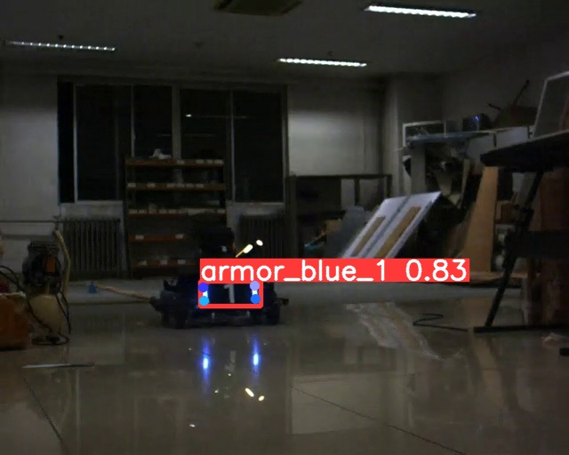

# Yolov8-Armor: A RoboMaster Armor Detector Based On Yolov8
## Introduction
RoboMaster Armor Detector Based On Yolov8 is a detector that can detect robot’s armor and four keypoints of the armor’s light. The detector is based on Yolov8 and is trained on RoboMaster dataset. The detector is used in RoboMaster 2023 competition.

## Demo


## Requirements
- Python >= 3.7
- Pytorch >= 1.7

You can install the requirements by running:
```bash
pip install -r requirements.txt
```

## Datasets
You can create custom datasets by using the [coco-annotator](https://github.com/jsbroks/coco-annotator) tool. The dataset should be in coco format. 

than you can use the **coco2yolo.py** to convert the coco format to yolo format.

note: make sure create the keypoint annotations.

